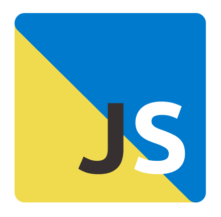

# Run js web
<p align="center">
  
</p>

This is a Next.js version 14 project that requires [Node.js 18 or higher](https://nodejs.org/en). The project has two start scripts: __yarn start:dev__ to run in development mode and __yarn start:prod__ to run in production mode.

## Requirements

- Node.js 18 or higher.

## Commands

To run the project in development mode, use the following command:

``` 
yarn start:dev
```

To run the project in production mode, use the following command:

``` 
yarn start:prod
```

## Docker

The project includes a __docker-compose.stage.yml__ file 
that you can use to run the project in a docker container.

To start the project in a Docker environment, make sure you have [Docker installed](https://www.docker.com/) and run the following command:

``` 
docker-compose -f docker-compose.stage.yml up
``` 

## Code running

This project connects to a web service at the following URL: [https://run-js-api.mg-hp.com](https://run-js-api.mg-hp.com). The code is executed via HTTP.
